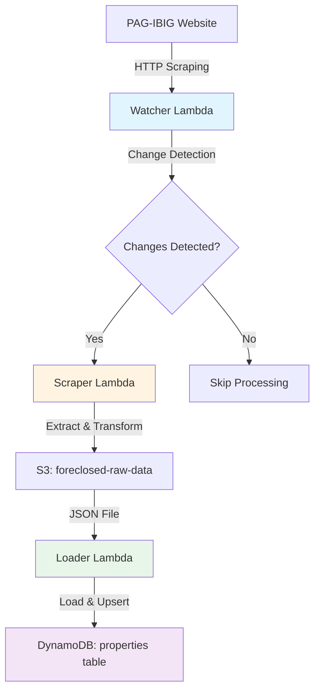
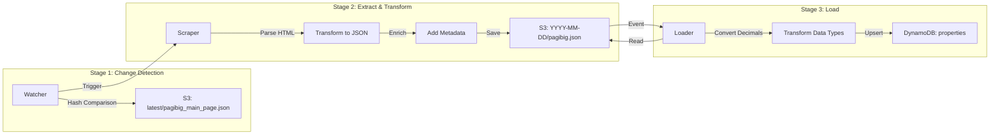
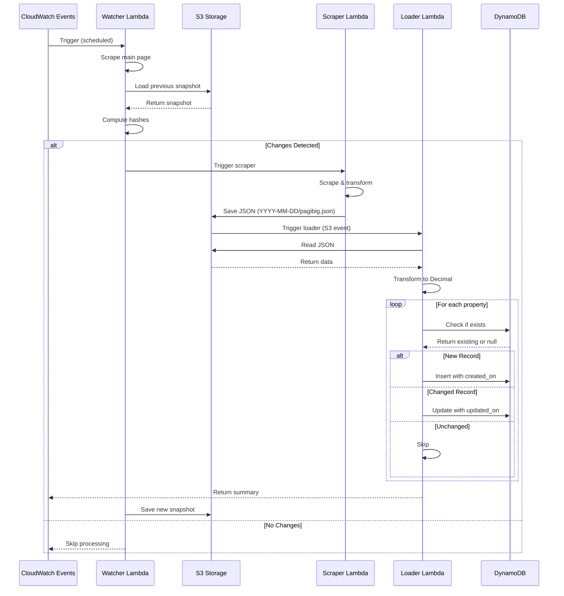

# ETL Pipeline Evaluation: PAG-IBIG Foreclosed Properties

**Date:** 2026-05-16  
**Evaluated By:** Bob (Planning Mode)  
**System:** Foreclosed Properties Data Pipeline

---

## Executive Summary

This document provides a comprehensive evaluation of the existing ETL (Extract, Transform, Load) pipeline for PAG-IBIG foreclosed property data. The system implements a **3-stage serverless architecture** using AWS Lambda, S3, and DynamoDB, with intelligent change detection to minimize unnecessary processing.

**Key Findings:**
- ✅ Complete ETL pipeline with all three stages implemented
- ✅ Smart change detection reduces processing overhead
- ✅ Idempotent operations ensure data consistency
- ⚠️ Some areas for optimization and error handling improvements

---

## Architecture Overview

### High-Level Data Flow



### Component Architecture



---

## Component Analysis

### 1. Watcher Lambda (`backend/watcher/watcher.py`)

**Purpose:** Change detection and orchestration

**Responsibilities:**
- Scrapes PAG-IBIG main page for batch metadata
- Computes hash of relevant fields (batch_no, dates)
- Compares with previous snapshot stored in S3
- Triggers scraper only when changes detected
- Stores current snapshot for next comparison

**Key Features:**
- **Smart Filtering:** Only hashes relevant fields for change detection
- **First-Run Handling:** Automatically triggers scraper on initial run
- **Change Reporting:** Logs added, removed, and updated batches

**Data Flow:**
```
PAG-IBIG Website → parse_main_page() → compute_hash() → 
compare with S3 snapshot → trigger scraper if changed → 
save new snapshot
```

**Code Snippet:**
```python
def compute_hash(data):
    filtered = [{k: v for k, v in d.items() 
                 if k in ['batch_no', 'bid_acceptance_start', 
                         'bid_acceptance_end', 'opening_of_offers']} 
                for d in data]
    return hashlib.sha256(json.dumps(filtered, sort_keys=True)
                         .encode('utf-8')).hexdigest()
```

---

### 2. Scraper Lambda (`backend/scraper/scraper.py`)

**Purpose:** Extract and transform property data

**Extract Stage:**
- Scrapes PAG-IBIG website HTML
- Parses batch metadata (branches, tranches, dates)
- Fetches detailed property data via API calls

**Transform Stage:**
- Converts HTML to structured JSON
- Parses dates to ISO 8601 format
- Enriches property records with batch metadata
- Adds `updated_on` timestamp

**Key Features:**
- **Multi-Source Extraction:** Combines main page + API data
- **Rate Limiting:** 1-second delay between API calls
- **Error Resilience:** Continues processing on individual failures
- **Date Normalization:** Handles multiple date formats

**Data Schema (Output):**
```json
{
  "type": "pag-ibig",
  "discount": "Properties with no discount (1st auction)",
  "branch": "BACOLOD BRANCH",
  "tranche_number": "OPA5910008",
  "batch_no": "OPA5910008",
  "areas": ["NEGROS OCCIDENTAL", "ILOILO"],
  "bid_acceptance_start": "2025-06-09T00:00:00",
  "bid_acceptance_end": "2025-06-13T23:59:00",
  "opening_of_offers": "2025-06-19T09:00:00",
  "ropa_id": "858202309280002",
  "prop_location": "Lot 3795-D-3-E...",
  "prop_type": "Lot Only",
  "tct_cct_no": "097-2024002768",
  "lot_area": "352",
  "floor_area": "0",
  "min_sellprice": 915200,
  "appr_date": "2024-05-31T00:00:00",
  "req_gross": 16100.13,
  "remarks": "UNOCCUPIED-LOT - TITLE UNDER HDMF",
  "status": "1",
  "city_muni": "ROXAS CITY",
  "inspection_date": "2025-04-25T00:00:00",
  "ins_remarks": "11.567913,122.729103",
  "updated_on": "2025-06-12T06:34:30.640214Z"
}
```

**Storage:**
- S3 Bucket: `foreclosed-raw-data`
- Key Pattern: `YYYY-MM-DD/pagibig.json`
- Format: JSON with 2-space indentation

---

### 3. Loader Lambda (`backend/loader/loader.py`)

**Purpose:** Load data into DynamoDB with intelligent upsert logic

**Load Stage Operations:**

#### 3.1 Extract from S3
```python
response = s3.get_object(Bucket=bucket_name, Key=object_key)
content = response["Body"].read().decode("utf-8")
data = json.loads(content)
```

#### 3.2 Transform Data Types
```python
# Convert floats to Decimal for DynamoDB compatibility
data = [json.loads(json.dumps(item), parse_float=Decimal) 
        for item in data]
```

#### 3.3 Load with Upsert Logic

**Primary Key Generation:**
```python
item["source_property_id"] = f"pagibig_{item['ropa_id']}"
```

**Three-Way Logic:**

1. **Add New Records:**
   - Check if `source_property_id` exists in DynamoDB
   - If not found, add `created_on` timestamp
   - Insert record
   - Increment `added_count`

2. **Update Changed Records:**
   - Compare all fields except `updated_on` and `created_on`
   - If any field differs, add `updated_on` timestamp
   - Update record
   - Increment `updated_count`

3. **Skip Unchanged Records:**
   - If all fields match, skip update
   - Increment `unchanged_count`

**Code Flow:**
```python
for item in data:
    if "ropa_id" not in item:
        logger.warning(f"Skipping item (missing ropa_id)")
        continue
    
    item["source_property_id"] = f"pagibig_{item['ropa_id']}"
    existing_item = table.get_item(Key={"source_property_id": ...})
    
    if not existing_item:
        item["created_on"] = datetime.utcnow().isoformat()
        table.put_item(Item=item)
        added_count += 1
    else:
        needs_update = any(item.get(k) != existing_item.get(k) 
                          for k in item if k not in ("updated_on", "created_on"))
        if needs_update:
            item["updated_on"] = datetime.utcnow().isoformat()
            table.put_item(Item=item)
            updated_count += 1
        else:
            unchanged_count += 1
```

**Output Summary:**
```json
{
  "added": 150,
  "updated": 25,
  "unchanged": 1200,
  "total": 1375
}
```

---

## Data Flow Sequence

### Complete ETL Cycle



---

## Configuration

### Environment Variables

| Component | Variable | Default | Purpose |
|-----------|----------|---------|---------|
| Scraper | `FORECLOSED_RAW_DATA_BUCKET` | `foreclosed-raw-data` | S3 bucket for raw data |
| Watcher | `FORECLOSED_RAW_DATA_BUCKET` | `foreclosed-raw-data` | S3 bucket for snapshots |
| Loader | `AWS_PROFILE` | `default` | AWS profile (local only) |

### Hardcoded Configuration

**Loader (`loader.py`):**
```python
bucket_name = "foreclosed-raw-data"
object_key = "test.json"  # ⚠️ Should be dynamic
table_name = "properties"
region_name = "us-east-1"
```

**Scraper (`scraper.py`):**
```python
BASE_URL = "https://www.pagibigfundservices.com/OnlinePublicAuction"
API_URL = f"{BASE_URL}/ListofProperties/Load_ListProperties"
```

---

## Strengths

### 1. **Intelligent Change Detection**
- Avoids unnecessary scraping and processing
- Reduces AWS costs and API load
- Hash-based comparison is efficient

### 2. **Idempotent Operations**
- Safe to re-run at any stage
- Upsert logic prevents duplicates
- Timestamp tracking maintains history

### 3. **Comprehensive Logging**
- Detailed progress tracking
- Error reporting with context
- Summary statistics for monitoring

### 4. **Error Resilience**
- Individual item failures don't stop processing
- Continues with remaining items
- Logs errors for investigation

### 5. **Data Type Handling**
- Proper Decimal conversion for DynamoDB
- Date normalization to ISO 8601
- UTF-8 encoding support

### 6. **Serverless Architecture**
- Auto-scaling with Lambda
- Pay-per-use pricing model
- No infrastructure management

---

## Areas for Improvement

### 1. **Configuration Management** (Priority: HIGH)

**Issue:** Hardcoded values in loader
```python
object_key = "test.json"  # Should be dynamic
```

**Recommendation:**
- Use environment variables for all configuration
- Accept S3 key from Lambda event trigger
- Support multiple data sources

**Proposed Change:**
```python
# In loader.py
object_key = event.get('Records', [{}])[0].get('s3', {}).get('object', {}).get('key', 'test.json')
bucket_name = os.environ.get('FORECLOSED_RAW_DATA_BUCKET', 'foreclosed-raw-data')
table_name = os.environ.get('DYNAMODB_TABLE', 'properties')
```

### 2. **Error Handling** (Priority: HIGH)

**Issue:** Silent failures in loader
```python
except Exception as e:
    logger.error(f"❌ Error on {i}: {item.get('source_property_id', 'UNKNOWN')} -> {e}")
    # Continues without tracking failed items
```

**Recommendation:**
- Track failed items separately
- Return detailed error report
- Consider dead-letter queue for retries

**Proposed Enhancement:**
```python
failed_items = []
for i, item in enumerate(data, 1):
    try:
        # ... processing logic ...
    except Exception as e:
        logger.error(f"❌ Error on {i}: {e}")
        failed_items.append({
            "item": item,
            "error": str(e),
            "index": i
        })

return {
    "added": added_count,
    "updated": updated_count,
    "unchanged": unchanged_count,
    "failed": len(failed_items),
    "failed_items": failed_items[:10],  # First 10 for debugging
    "total": len(data)
}
```

### 3. **Batch Operations** (Priority: MEDIUM)

**Issue:** Individual DynamoDB operations
```python
table.put_item(Item=item)  # One at a time
```

**Recommendation:**
- Use `batch_write_item` for better performance
- Process in chunks of 25 (DynamoDB limit)
- Reduce API calls and costs

**Proposed Implementation:**
```python
from boto3.dynamodb.types import TypeSerializer

def batch_write_items(table, items, batch_size=25):
    serializer = TypeSerializer()
    for i in range(0, len(items), batch_size):
        batch = items[i:i + batch_size]
        with table.batch_writer() as writer:
            for item in batch:
                writer.put_item(Item=item)
```

### 4. **Data Validation** (Priority: MEDIUM)

**Issue:** Minimal validation before loading
```python
if "ropa_id" not in item:
    logger.warning(f"Skipping item {i} (missing ropa_id)")
    continue
```

**Recommendation:**
- Validate required fields
- Check data types and formats
- Sanitize input data

**Proposed Schema Validation:**
```python
REQUIRED_FIELDS = ['ropa_id', 'prop_location', 'min_sellprice', 'batch_no']
NUMERIC_FIELDS = ['min_sellprice', 'lot_area', 'floor_area', 'req_gross']

def validate_item(item):
    # Check required fields
    missing = [f for f in REQUIRED_FIELDS if f not in item]
    if missing:
        return False, f"Missing fields: {missing}"
    
    # Validate numeric fields
    for field in NUMERIC_FIELDS:
        if field in item and item[field]:
            try:
                float(item[field])
            except (ValueError, TypeError):
                return False, f"Invalid numeric value for {field}"
    
    return True, None
```

### 5. **Monitoring & Alerting** (Priority: MEDIUM)

**Issue:** No automated alerting for failures

**Recommendation:**
- Add CloudWatch metrics
- Set up SNS notifications for errors
- Track processing time and success rates

**Proposed Metrics:**
```python
import boto3
cloudwatch = boto3.client('cloudwatch')

def publish_metrics(namespace, metrics):
    cloudwatch.put_metric_data(
        Namespace=namespace,
        MetricData=[
            {
                'MetricName': 'ItemsAdded',
                'Value': metrics['added'],
                'Unit': 'Count'
            },
            {
                'MetricName': 'ItemsUpdated',
                'Value': metrics['updated'],
                'Unit': 'Count'
            },
            {
                'MetricName': 'ProcessingErrors',
                'Value': metrics.get('failed', 0),
                'Unit': 'Count'
            }
        ]
    )
```

### 6. **Testing** (Priority: MEDIUM)

**Issue:** No unit tests or integration tests

**Recommendation:**
- Add unit tests for transformation logic
- Mock AWS services for testing
- Add integration tests for end-to-end flow

**Proposed Test Structure:**
```python
# tests/test_loader.py
import pytest
from moto import mock_s3, mock_dynamodb
from backend.loader.loader import process_data

@mock_s3
@mock_dynamodb
def test_loader_adds_new_items():
    # Setup mock S3 and DynamoDB
    # Test adding new items
    # Assert correct counts
    pass

@mock_dynamodb
def test_loader_updates_changed_items():
    # Test update logic
    pass
```

### 7. **Documentation** (Priority: LOW)

**Issue:** Limited inline documentation

**Recommendation:**
- Add docstrings to functions
- Document data schemas
- Create API documentation

### 8. **Performance Optimization** (Priority: LOW)

**Issue:** Sequential processing

**Recommendation:**
- Consider parallel processing for large datasets
- Use DynamoDB streams for real-time updates
- Implement pagination for large S3 files

---

## Data Schema Documentation

### DynamoDB Table: `properties`

**Primary Key:**
- Partition Key: `source_property_id` (String)
  - Format: `pagibig_{ropa_id}`
  - Example: `pagibig_858202309280002`

**Attributes:**

| Field | Type | Required | Description |
|-------|------|----------|-------------|
| `source_property_id` | String | Yes | Unique identifier (PK) |
| `ropa_id` | String | Yes | PAG-IBIG property ID |
| `type` | String | Yes | Always "pag-ibig" |
| `discount` | String | Yes | Auction type/discount level |
| `branch` | String | Yes | PAG-IBIG branch |
| `tranche_number` | String | Yes | Tranche identifier |
| `batch_no` | String | Yes | Batch identifier |
| `areas` | List | Yes | Coverage areas |
| `bid_acceptance_start` | String | Yes | ISO 8601 datetime |
| `bid_acceptance_end` | String | Yes | ISO 8601 datetime |
| `opening_of_offers` | String | Yes | ISO 8601 datetime |
| `prop_location` | String | Yes | Full property address |
| `prop_type` | String | Yes | Property type |
| `tct_cct_no` | String | No | Title number |
| `lot_area` | String | No | Lot area in sqm |
| `floor_area` | String | No | Floor area in sqm |
| `min_sellprice` | Number | Yes | Minimum selling price |
| `appr_date` | String | No | Appraisal date |
| `req_gross` | Number | No | Required gross income |
| `remarks` | String | No | Property remarks |
| `status` | String | No | Property status |
| `city_muni` | String | No | City/Municipality |
| `inspection_date` | String | No | Inspection date |
| `ins_remarks` | String | No | Inspection remarks (often coordinates) |
| `created_on` | String | Auto | ISO 8601 datetime (first insert) |
| `updated_on` | String | Auto | ISO 8601 datetime (last update) |

---

## Operational Considerations

### 1. **Deployment**

**Current Setup:**
- Lambda functions deployed via Terraform
- S3 bucket for raw data storage
- DynamoDB table for processed data

**Deployment Checklist:**
- [ ] Configure environment variables
- [ ] Set up IAM roles and permissions
- [ ] Configure S3 event triggers
- [ ] Set up CloudWatch Events for watcher
- [ ] Configure Lambda timeout and memory
- [ ] Set up CloudWatch Logs retention

### 2. **Monitoring**

**Key Metrics to Track:**
- Lambda invocation count and duration
- Error rates and types
- DynamoDB read/write capacity
- S3 storage usage
- Processing success/failure rates

**Recommended Alarms:**
- Lambda errors > 5% of invocations
- Processing time > 5 minutes
- Failed items > 10% of batch
- No data updates for > 7 days

### 3. **Cost Optimization**

**Current Cost Drivers:**
- Lambda invocations and duration
- DynamoDB read/write operations
- S3 storage and requests

**Optimization Strategies:**
- Use batch operations to reduce API calls
- Implement change detection (already done)
- Use S3 lifecycle policies for old data
- Consider DynamoDB on-demand pricing

### 4. **Disaster Recovery**

**Current State:**
- S3 data is versioned (if enabled)
- DynamoDB has point-in-time recovery (if enabled)

**Recommendations:**
- Enable S3 versioning
- Enable DynamoDB PITR
- Regular backups to separate bucket
- Document recovery procedures

---

## Performance Metrics

### Current Performance (Estimated)

| Metric | Value | Notes |
|--------|-------|-------|
| Scraper Duration | 2-5 minutes | Depends on property count |
| Loader Duration | 30-120 seconds | Depends on batch size |
| Items per Second | 10-20 | DynamoDB throughput |
| API Rate Limit | 1 req/second | Self-imposed delay |
| Batch Size | 1000-2000 items | Typical property count |

### Optimization Potential

| Optimization | Expected Improvement | Effort |
|--------------|---------------------|--------|
| Batch writes | 5-10x faster | Medium |
| Parallel processing | 2-3x faster | High |
| Caching | Reduced API calls | Medium |
| Connection pooling | 10-20% faster | Low |

---

## Security Considerations

### Current Security Measures

✅ **IAM Roles:** Lambda uses IAM roles (not access keys)  
✅ **VPC:** Can be deployed in VPC if needed  
✅ **Encryption:** S3 and DynamoDB support encryption at rest  

### Recommendations

1. **Enable encryption at rest** for S3 and DynamoDB
2. **Use VPC endpoints** for S3 and DynamoDB access
3. **Implement least privilege** IAM policies
4. **Enable CloudTrail** for audit logging
5. **Rotate credentials** if using any API keys
6. **Validate input data** to prevent injection attacks

---

## Future Enhancements

### Short-term (1-3 months)

1. **Implement batch operations** for DynamoDB
2. **Add comprehensive error handling** and reporting
3. **Set up monitoring and alerting**
4. **Add unit and integration tests**
5. **Make configuration fully dynamic**

### Medium-term (3-6 months)

1. **Add data validation layer**
2. **Implement retry logic with exponential backoff**
3. **Add support for multiple data sources**
4. **Create admin dashboard for monitoring**
5. **Implement data quality checks**

### Long-term (6-12 months)

1. **Add machine learning for price predictions**
2. **Implement real-time notifications**
3. **Add geospatial search capabilities**
4. **Create data warehouse for analytics**
5. **Build API for external integrations**

---

## Conclusion

The current ETL pipeline is **well-architected and functional**, with intelligent change detection and proper data flow. The three-stage architecture (Watcher → Scraper → Loader) effectively processes PAG-IBIG foreclosed property data.

**Key Strengths:**
- Smart change detection minimizes unnecessary processing
- Idempotent operations ensure data consistency
- Good logging and error handling foundation
- Serverless architecture provides scalability

**Priority Improvements:**
1. Make configuration fully dynamic (HIGH)
2. Enhance error handling and reporting (HIGH)
3. Implement batch operations (MEDIUM)
4. Add data validation (MEDIUM)
5. Set up monitoring and alerting (MEDIUM)

The pipeline is production-ready with minor improvements. Focus on configuration management and error handling first, then optimize performance with batch operations.

---

## Appendix

### A. File Structure

```
backend/
├── loader/
│   ├── loader.py              # Main ETL load logic
│   ├── lambda_function.py     # Lambda entry point
│   └── requirements.txt       # Dependencies (empty)
├── scraper/
│   ├── scraper.py             # Extract & transform logic
│   ├── lambda_function.py     # Lambda entry point
│   └── requirements.txt       # Dependencies
└── watcher/
    ├── watcher.py             # Change detection logic
    ├── lambda_function.py     # Lambda entry point
    └── requirements.txt       # Dependencies
```

### B. Dependencies

**Loader:**
- `boto3` - AWS SDK
- `json` - JSON parsing
- `decimal` - Decimal type for DynamoDB
- `datetime` - Timestamp handling
- `logging` - Logging

**Scraper:**
- `requests` - HTTP client
- `beautifulsoup4` - HTML parsing
- `boto3` - AWS SDK
- `json` - JSON handling

**Watcher:**
- `boto3` - AWS SDK
- `hashlib` - Hash computation
- `json` - JSON handling

### C. Useful Commands

**Local Testing:**
```bash
# Test loader locally
cd backend/loader
python loader.py

# Test scraper locally
cd backend/scraper
python scraper.py

# Test watcher locally
cd backend/watcher
python watcher.py
```

**AWS CLI Commands:**
```bash
# Invoke loader Lambda
aws lambda invoke --function-name foreclosed-loader output.json

# Check DynamoDB table
aws dynamodb scan --table-name properties --max-items 10

# List S3 objects
aws s3 ls s3://foreclosed-raw-data/ --recursive

# View CloudWatch logs
aws logs tail /aws/lambda/foreclosed-loader --follow
```

### D. References

- [AWS Lambda Documentation](https://docs.aws.amazon.com/lambda/)
- [DynamoDB Best Practices](https://docs.aws.amazon.com/amazondynamodb/latest/developerguide/best-practices.html)
- [S3 Event Notifications](https://docs.aws.amazon.com/AmazonS3/latest/userguide/NotificationHowTo.html)
- [PAG-IBIG Foreclosed Properties](https://www.pagibigfundservices.com/OnlinePublicAuction)

---

**Document Version:** 1.0  
**Last Updated:** 2026-05-16  
**Next Review:** 2026-08-16