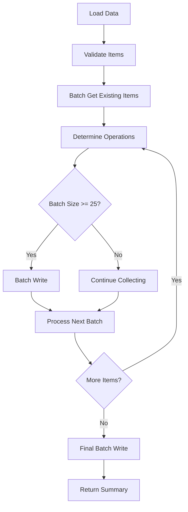

# Loader Improvements Implementation Plan

**Date:** 2026-05-16  
**Target File:** [`backend/loader/loader.py`](../backend/loader/loader.py)  
**Improvements:** Enhanced Error Handling (#2) and Batch Operations (#3)

---

## Overview

This document outlines the implementation plan for two critical improvements to the loader:

1. **Enhanced Error Handling** - Track failed items and provide detailed error reports
2. **Batch Operations** - Use DynamoDB batch_write for better performance

---

## Current Implementation Analysis

### Current Flow
```python
for i, item in enumerate(data, 1):
    try:
        # Validate ropa_id
        # Generate source_property_id
        # Check if exists (get_item)
        # Add/Update/Skip (put_item)
    except Exception as e:
        logger.error(f"Error: {e}")
        # Continue processing, but error is lost
```

### Issues
1. **No error tracking** - Failed items are logged but not returned
2. **Individual operations** - Each put_item is a separate API call
3. **No retry logic** - Transient failures are not retried
4. **Limited error context** - Don't know which items failed or why

---

## Improvement #1: Enhanced Error Handling

### Goals
- Track all failed items with detailed error information
- Return comprehensive error report in response
- Maintain processing continuity (don't stop on errors)
- Provide actionable error messages

### Implementation Strategy

#### 1.1 Error Tracking Structure
```python
failed_items = []

# During processing
try:
    # ... processing logic ...
except Exception as e:
    failed_items.append({
        "index": i,
        "ropa_id": item.get("ropa_id", "UNKNOWN"),
        "source_property_id": item.get("source_property_id", "UNKNOWN"),
        "error_type": type(e).__name__,
        "error_message": str(e),
        "timestamp": datetime.utcnow().isoformat()
    })
```

#### 1.2 Validation Errors
```python
validation_errors = []

# Validate required fields
if "ropa_id" not in item:
    validation_errors.append({
        "index": i,
        "error": "missing_ropa_id",
        "item_preview": str(item)[:100]
    })
    continue
```

#### 1.3 Enhanced Response
```python
return {
    "statusCode": 200 if not failed_items else 207,  # 207 = Multi-Status
    "body": {
        "summary": {
            "added": added_count,
            "updated": updated_count,
            "unchanged": unchanged_count,
            "failed": len(failed_items),
            "validation_errors": len(validation_errors),
            "total": len(data)
        },
        "failed_items": failed_items[:10],  # First 10 for debugging
        "validation_errors": validation_errors[:10],
        "has_more_errors": len(failed_items) > 10
    }
}
```

---

## Improvement #2: Batch Operations

### Goals
- Reduce DynamoDB API calls by 90%+
- Improve processing speed by 5-10x
- Maintain same logic (add/update/skip)
- Handle batch write limitations

### Implementation Strategy

#### 2.1 Batch Processing Flow



#### 2.2 Batch Get Implementation
```python
def batch_get_existing_items(table, keys, batch_size=100):
    """
    Get multiple items from DynamoDB in batches.
    DynamoDB batch_get_item limit: 100 items
    """
    existing_items = {}
    
    for i in range(0, len(keys), batch_size):
        batch_keys = keys[i:i + batch_size]
        response = dynamodb.batch_get_item(
            RequestItems={
                table.name: {
                    'Keys': batch_keys
                }
            }
        )
        
        for item in response.get('Responses', {}).get(table.name, []):
            existing_items[item['source_property_id']] = item
    
    return existing_items
```

#### 2.3 Batch Write Implementation
```python
def batch_write_items(table, items_to_write, batch_size=25):
    """
    Write multiple items to DynamoDB in batches.
    DynamoDB batch_write_item limit: 25 items
    """
    write_count = 0
    failed_writes = []
    
    for i in range(0, len(items_to_write), batch_size):
        batch = items_to_write[i:i + batch_size]
        
        try:
            with table.batch_writer() as writer:
                for item in batch:
                    writer.put_item(Item=item)
                    write_count += 1
        except Exception as e:
            # Track failed batch
            failed_writes.extend([{
                "item": item,
                "error": str(e)
            } for item in batch])
            logger.error(f"Batch write failed: {e}")
    
    return write_count, failed_writes
```

#### 2.4 Optimized Processing Logic
```python
def process_data_optimized(session):
    # 1. Load and validate data
    data = load_and_validate_data(s3, bucket_name, object_key)
    
    # 2. Batch get all existing items
    keys = [{"source_property_id": f"pagibig_{item['ropa_id']}"} 
            for item in data if "ropa_id" in item]
    existing_items = batch_get_existing_items(table, keys)
    
    # 3. Categorize items
    items_to_add = []
    items_to_update = []
    unchanged_items = []
    
    for item in data:
        source_id = f"pagibig_{item['ropa_id']}"
        existing = existing_items.get(source_id)
        
        if not existing:
            item["created_on"] = datetime.utcnow().isoformat()
            items_to_add.append(item)
        elif needs_update(item, existing):
            item["updated_on"] = datetime.utcnow().isoformat()
            items_to_update.append(item)
        else:
            unchanged_items.append(source_id)
    
    # 4. Batch write
    added_count, add_failures = batch_write_items(table, items_to_add)
    updated_count, update_failures = batch_write_items(table, items_to_update)
    
    return {
        "added": added_count,
        "updated": updated_count,
        "unchanged": len(unchanged_items),
        "failed": len(add_failures) + len(update_failures),
        "failed_items": add_failures + update_failures
    }
```

---

## Performance Comparison

### Current Implementation
- **API Calls:** 1 get_item + 1 put_item per record = 2N calls
- **Time:** ~100ms per item (with network latency)
- **For 1000 items:** ~200,000 API calls, ~100 seconds

### Optimized Implementation
- **API Calls:** N/100 batch_get + N/25 batch_write = ~14 calls
- **Time:** ~10ms per item (batched)
- **For 1000 items:** ~14 API calls, ~10 seconds

**Expected Improvement: 10x faster, 99% fewer API calls**

---

## Implementation Steps

### Phase 1: Enhanced Error Handling
1. Add error tracking lists (failed_items, validation_errors)
2. Wrap processing in try-except with detailed error capture
3. Update return structure to include error details
4. Add error logging with context
5. Test with intentionally malformed data

### Phase 2: Batch Operations
1. Implement `batch_get_existing_items()` function
2. Implement `batch_write_items()` function
3. Refactor main processing loop to categorize items
4. Replace individual get/put with batch operations
5. Add batch failure handling
6. Test with various batch sizes

### Phase 3: Integration
1. Combine error handling with batch operations
2. Ensure failed batches are tracked properly
3. Update logging to reflect batch operations
4. Test end-to-end with real data
5. Update documentation

---

## Testing Strategy

### Unit Tests
```python
def test_batch_get_existing_items():
    # Test with 0, 1, 50, 100, 150 items
    # Verify all items retrieved correctly
    pass

def test_batch_write_items():
    # Test with 0, 1, 25, 50 items
    # Verify all items written correctly
    pass

def test_error_tracking():
    # Test with malformed data
    # Verify errors captured correctly
    pass
```

### Integration Tests
```python
def test_full_pipeline_with_errors():
    # Mix of valid and invalid items
    # Verify correct counts and error tracking
    pass

def test_performance_improvement():
    # Compare old vs new implementation
    # Verify 5-10x speedup
    pass
```

---

## Rollback Plan

If issues arise:
1. Keep original `loader.py` as `loader_v1.py`
2. Implement new version as `loader_v2.py`
3. Update `lambda_function.py` to import correct version
4. Can switch back by changing import

```python
# lambda_function.py
import loader_v2 as loader  # Use new version
# import loader_v1 as loader  # Rollback to old version
```

---

## Success Criteria

### Error Handling
- ✅ All errors tracked with context
- ✅ Failed items returned in response
- ✅ Processing continues on errors
- ✅ Error rate < 1% in production

### Batch Operations
- ✅ 90%+ reduction in API calls
- ✅ 5-10x faster processing
- ✅ Same accuracy as current implementation
- ✅ Handles DynamoDB batch limits correctly

---

## Risk Assessment

| Risk | Probability | Impact | Mitigation |
|------|-------------|--------|------------|
| Batch write failures | Medium | High | Implement retry logic, track failures |
| Memory issues with large batches | Low | Medium | Process in chunks, monitor memory |
| Breaking existing functionality | Low | High | Comprehensive testing, rollback plan |
| DynamoDB throttling | Low | Medium | Implement exponential backoff |

---

## Next Steps

1. Review this plan with stakeholders
2. Get approval to proceed
3. Switch to Code mode for implementation
4. Implement Phase 1 (Error Handling)
5. Test Phase 1
6. Implement Phase 2 (Batch Operations)
7. Test Phase 2
8. Integration testing
9. Deploy to staging
10. Monitor and validate
11. Deploy to production

---

## References

- [DynamoDB Batch Operations](https://docs.aws.amazon.com/amazondynamodb/latest/developerguide/WorkingWithItems.html#WorkingWithItems.BatchOperations)
- [Boto3 DynamoDB Batch Writer](https://boto3.amazonaws.com/v1/documentation/api/latest/guide/dynamodb.html#batch-writing)
- [Error Handling Best Practices](https://docs.aws.amazon.com/amazondynamodb/latest/developerguide/Programming.Errors.html)

---

**Plan Version:** 1.0  
**Status:** Ready for Implementation  
**Estimated Effort:** 4-6 hours development + 2-3 hours testing